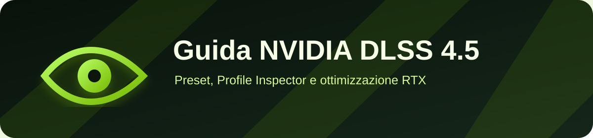

  
  
<strong>Preset DLSS 4.5, Profile Inspector e ottimizzazione per RTX 20/30/40/50.</strong>

  

    
    
    
  

  

    
    
    
    
    
  

  
<a href="https://primebuild-pc.github.io/guida-completa-nvidia-dlss-4.5/">📖 Visualizza guida</a> · <a href="https://discord.gg/jBNk2vXKKd">💬 Discord</a> · <a href="https://www.instagram.com/prime_build_/">📸 Instagram</a>

---

## 📋 Contenuti

- **DLSS 4.5 Fundamentals** - Architettura Transformer Gen2, preset K/M/L
- **Configurazione Avanzata** - NVIDIA App vs Profile Inspector (v2.4.0.30)
- **Tabelle Comparative** - Overhead computazionale per GPU (da NVIDIA Programming Guide)
- **Best Practices** - Coordinamento preset/risoluzione/GPU per qualità e FPS ottimali
- **Analisi Tecnica** - Review dettagliata Prodig, benchmark reali CP77/BF6

## 🚀 Quick Start

Apri [`index.html`](index.html) nel browser o visita la [versione online](https://primebuild-pc.github.io/guida-completa-nvidia-dlss-4.5/).

## 🎯 Preset Overview

| Preset | Versione | Ottimizzato Per | GPU Supportate |
|--------|----------|-----------------|----------------|
| **K** | DLSS 4.0 | Quality/Balanced/DLAA | RTX 20+ |
| **M** | DLSS 4.5 | Performance | RTX 40/50 (raccomandato) |
| **L** | DLSS 4.5 | Ultra Performance 4K+ | RTX 40/50 solo |

## 📚 Risorse

- [NVIDIA Profile Inspector v2.4.0.30](https://github.com/Orbmu2k/nvidiaProfileInspector/releases)
- [DLSS Programming Guide](DLSS_Programming_Guide_Release.pdf) (pag. 16-18)
- Driver 591.74+ richiesti

## 🤝 Contributi

Contributi, correzioni e suggerimenti sono benvenuti! Apri una issue o PR.

## 📝 License

MIT License - vedi [LICENSE](LICENSE) per dettagli.

---

**Made with 🧡 by [PRIME BUILD](https://www.instagram.com/prime_build_/)**

